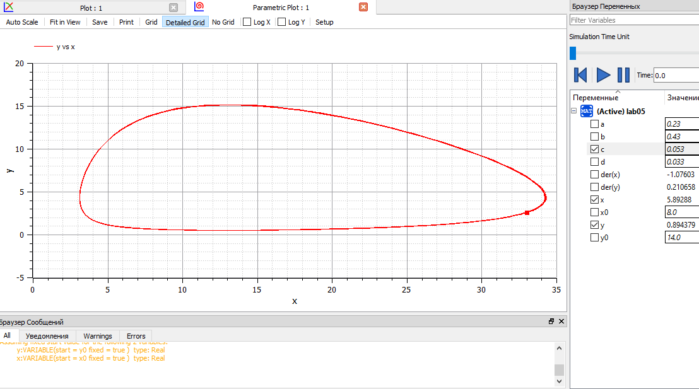

---
# Front matter
lang: ru-RU
title: "Лабораторная работа №5 по математическому моделированию"
subtitle: "Модель хищник-жертва"
author: "Хусайнова Фароиз Дилшодовна"

# Formatting
toc-title: "Содержание"
toc: true # Table of contents
toc_depth: 2
lof: true # List of figures
lot: true # List of tables
fontsize: 12pt
linestretch: 1.5
papersize: a4paper
documentclass: scrreprt
polyglossia-lang: russian
polyglossia-otherlangs: english
mainfont: PT Serif
romanfont: PT Serif
sansfont: PT Sans
monofont: PT Mono
mainfontoptions: Ligatures=TeX
romanfontoptions: Ligatures=TeX
sansfontoptions: Ligatures=TeX,Scale=MatchLowercase
monofontoptions: Scale=MatchLowercase
indent: true
pdf-engine: lualatex
header-includes:
  - \linepenalty=10 # the penalty added to the badness of each line within a paragraph (no associated penalty node) Increasing the value makes tex try to have fewer lines in the paragraph.
  - \interlinepenalty=0 # value of the penalty (node) added after each line of a paragraph.
  - \hyphenpenalty=50 # the penalty for line breaking at an automatically inserted hyphen
  - \exhyphenpenalty=50 # the penalty for line breaking at an explicit hyphen
  - \binoppenalty=700 # the penalty for breaking a line at a binary operator
  - \relpenalty=500 # the penalty for breaking a line at a relation
  - \clubpenalty=150 # extra penalty for breaking after first line of a paragraph
  - \widowpenalty=150 # extra penalty for breaking before last line of a paragraph
  - \displaywidowpenalty=50 # extra penalty for breaking before last line before a display math
  - \brokenpenalty=100 # extra penalty for page breaking after a hyphenated line
  - \predisplaypenalty=10000 # penalty for breaking before a display
  - \postdisplaypenalty=0 # penalty for breaking after a display
  - \floatingpenalty = 20000 # penalty for splitting an insertion (can only be split footnote in standard LaTeX)
  - \raggedbottom # or \flushbottom
  - \usepackage{float} # keep figures where there are in the text
  - \floatplacement{figure}{H} # keep figures where there are in the text
---

# Цель работы

Ознакомиться с простейшей моделью взаимодействия двух видов типа «хищник — жертва» - моделью Лотки-Вольтерры и ее построение с помощью языка программирования Modelica.

# Задание

Для модели «хищник-жертва»:
	$$ 
                \begin{cases}
                    \frac{dx}{dt} = -0.23x(t)+0.05x(t)y(t)
                    \\
                    \frac{dy}{dt} = 0.43y(t)-0.033x(t)y(t)
                 \end{cases}
        $$
Начальные условия: x_0 = 8 и y_0 = 14.

1. Построить график зависимости численности хищников от численности жертв.
2. Построить графики изменения численности хищников и численности жертв.
3. Найти стационарное состояние системы.

# Выполнение лабораторной работы

Выполняла я лабораторную работу на языке программирования Modelica. Ниже представлен программный код (рис. -@fig:001)

{ #fig:001 width=70% }

При запуске данного кода был выведен график зависимости численности популяции хищников от численности популяции жертв. (рис. -@fig:001)

{ #fig:001 width=70% }

Графики изменения численности популяции хищников и численности популяции жертв с течением времени (рис. -@fig:001)

{ #fig:001 width=70% }

Для того, чтобы найти стационарное состояние системы, необходимо приравнять производные каждой из функций x и y к нулю и выразить значения y и x соответственно.  

$$ x_0 = \frac{b}{d} = \frac{0.43}{0.033} \approx 13.03  $$
$$ y_0 = \frac{a}{c} = \frac{0.23}{0.053} \approx 4.339  $$

При стационарном состоянии значения числа жертв и хищников не меняется во времени. (рис. -@fig:001)  

{ #fig:001 width=70% }

# Выводы

При выполнении данной лабораторной работы я ознакомилась с простейшей моделью взаимодействия двух видов типа «хищник — жертва», научилась строить для нее графики и находить стационарное состояние системы.